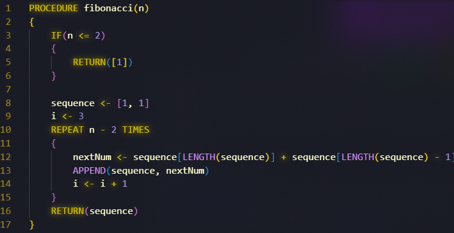
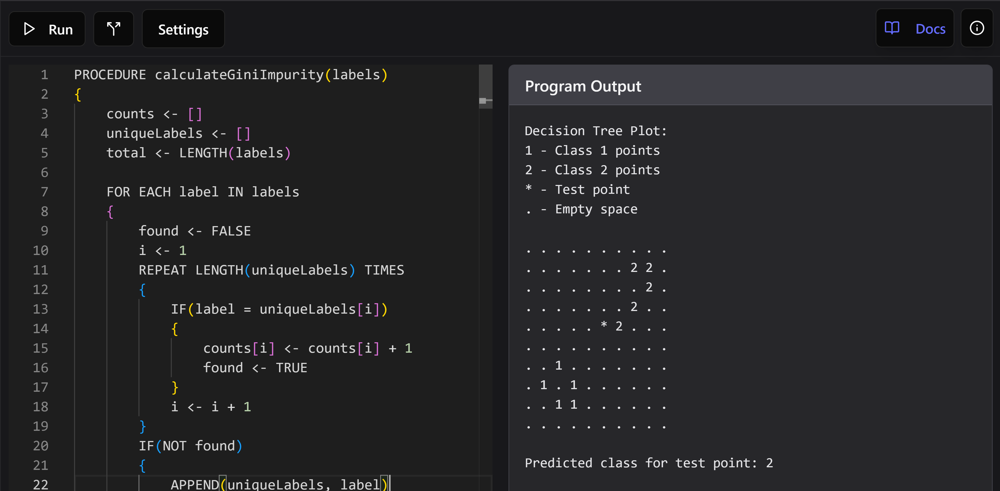

  <h1><a href="https://pseudo-lang.org/">Pseudolang</a></h1>

    

  

    
    
    
  

Welcome to Pseudolang! Pseudolang is a simple programming language written in Rust, inspired by College Board's Pseudocode.

This project aims to fully support 64-bit Windows, Linux, and WebAssembly (WASI CLI, wasm-bindgen for browser).

## Screenshots

  

  

## Releases

Go to **[nightly releases](https://nightly.link/PseudoLang-Software-Foundation/Pseudolang/workflows/build/main)** and download the binary for your operating system.

There is also an **installer** for Windows, that you can download in [GitHub releases](https://github.com/PseudoLang-Software-Foundation/Pseudolang/releases).

## Use

To use the compiled versions, run the executable and pass two parameters as the input and output file (pseudolang programs end with `.psl`). Ex: `fplc run main.psl`

If `fplc` is not added to path or environment variables, make sure to execute the binary specifically.

Free Pseudolang Compiler = fplc (like gcc, despite it being interpreted :)

## Compiling

In order to compile the project yourself, you will need to have rust installed.

- Install [**rust**](https://www.rust-lang.org/tools/install), and make sure you have it added to PATH.
- Clone the repository `git clone https://github.com/Pseudolang-Software-Foundation/PseudoLang.git`

  - To build **release**, you will need bash, cross (`cargo install cross`), wasm-pack, and docker. Then run `just build-all` from `jfiles/src/`. The binaries for each target will be in the `release` folder.
  - To build **debug**, simply run `cargo build`. The binary will be in the `target/debug` folder.

- In order to run the unit tests, simply run `cargo test`.
- For the NSIS installer, just compile `./installer/pseudolang.nsi`

## Just Commands

All recipes live in `jfiles/src/` and are run with [`just`](https://github.com/casey/just) from that directory.

| Command                   | Description                                                    |
| ------------------------- | -------------------------------------------------------------- |
| `just install`            | Install toolchain deps (cross, wasm-pack, taplo, WASM targets) |
| `just build`              | Debug build (native)                                           |
| `just release`            | Release build (native)                                         |
| `just build-wasm`         | Browser WASM via wasm-pack/wasm-bindgen                        |
| `just build-wasi`         | WASI CLI binary (`wasm32-wasip1`)                              |
| `just build-all`          | Full release: Windows, Linux, WASM, WASI + installer           |
| `just test`               | Run all tests                                                  |
| `just test-verbose`       | Run tests with stdout                                          |
| `just run <ARGS>`         | Run fplc in debug mode                                         |
| `just run-release <ARGS>` | Run fplc in release mode                                       |
| `just fmt`                | Clippy fix + rustfmt + taplo fmt                               |
| `just fmt-check`          | Lint/format check (no changes)                                 |
| `just check`              | `cargo check`                                                  |
| `just clean`              | Remove build artifacts                                         |
| `just tag-release`        | Tag current version and push (triggers CI release)             |

## Build / CI Pipeline

CI is defined in `.github/workflows/build.yml`. On every push it runs tests, then builds four targets in parallel:

1. **Windows** (`x86_64-pc-windows-gnu`) -- cross-compiled, plus NSIS installer
2. **Linux** (`x86_64-unknown-linux-gnu`) -- cross-compiled
3. **WASM** (`wasm32-unknown-unknown`) -- wasm-pack/wasm-bindgen bundle for browser embedding
4. **WASI** (`wasm32-wasip1`) -- standalone CLI binary for runtimes like webassembly.sh

Pushing a `vX.Y.Z` tag triggers a GitHub Release with all artifacts attached.

## Examples

[Pseudolang.md](Pseudolang.md) contains a full explanation of Collegeboard's Pseudocode and many features specific to PseudoLang.

The file `src/tests/mod.rs` also contains various unit tests (examples of code) for PseudoLang.

## To-do

- [ ] Debian package
- [ ] Proper documentation

Functionality

- [ ] Dictionaries
- [ ] Make sure error handling columns work
- [ ] Networking
- [ ] File IO
- [ ] System integration (terminal commands, process management, environment variables)
- [ ] Library support (remote procedures)
- [ ] Graphics
- [ ] Meta programming
- [ ] Multithreading
- [ ] Bundled compiler

Misc

- [ ] Testing for INPUT and SLEEP (mocking framework)
- [ ] More escape characters

## Issues

Feel free to make issues for any bugs or trouble that you experience with this! Especially since this is new, and there are going to be a lot of them!

## Contributing

We welcome contributions! If there are any bugs, or particularly pointing out limitations in [Pseudolang.md](Pseudolang.md) at the bottom, or adding things from the to-do list, please make a pull request!

## License

This project is licensed under the MIT License - see the [LICENSE file](LICENSE) file for details.
